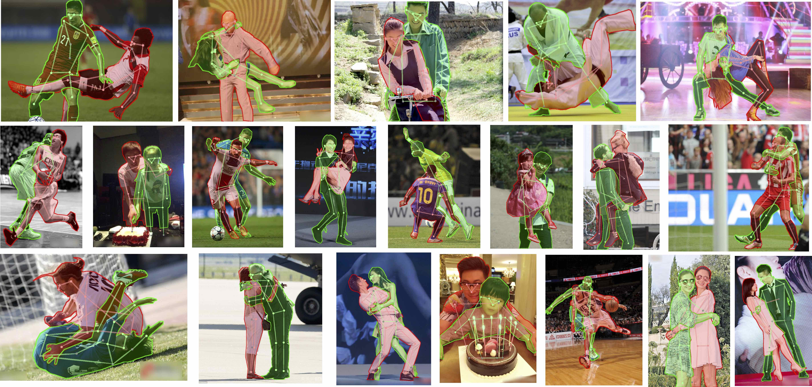

# OCHuman(Occluded Human) Dataset Api

Dataset proposed in "Pose2Seg: Detection Free Human Instance Segmentation" [[ProjectPage]](http://www.liruilong.cn/projects/pose2seg/index.html) [[arXiv]](https://arxiv.org/abs/1803.10683) @ CVPR2019. 

**News! 2019.06.14** val/test split is updated to match our paper!
**News! 2019.04.08** [Codes](https://github.com/liruilong940607/Pose2Seg) for our paper is available now!

<div align="center">

<p> Samples of OCHuman Dataset</p>
</div>

This dataset focus on heavily occluded human with comprehensive annotations including bounding-box, humans pose and instance mask. This dataset contains 13360 elaborately annotated human instances within 5081 images. With average 0.573 MaxIoU of each person, OCHuman is the most complex and challenging dataset related to human. Through this dataset, we want to emphasize occlusion as a challenging problem for researchers to study.


## Statistics

All the instances in this dataset are annotated by bounding-box. While not all of them have the
keypoint/mask annotation. If you want to compare your results with ours in the paper, please use the subset
that contains both keypoint and mask annotations (4731 images, 8110 persons).

|          | bbox  | keypoint | mask | keypoint&mask | bbox&keypoint&mask|
| ------   | ----- | ----- | ----- | ----- | ----- |
| #Images  | 5081  | 5081  | 4731  | 4731  | 4731  |
| #Persons | 13360 | 10375 | 8110  | 8110  | 8110  |
| #mMaxIou | 0.573 | 0.670 | 0.669 | 0.669 | 0.669 |

**Note**: 
- *MaxIoU* measures the severity of an object being occluded, which means the max IoU with other same category objects in a single image.
- All instances in OCHuman with kpt/mask annotations are suffered by heavy occlusion. (MaxIou > 0.5)

## Download Links

- [Images (667MB) & Annotations](https://cg.cs.tsinghua.edu.cn/dataset/form.html?dataset=ochuman)

In the above link, we also provide the coco style annotations (*val* and *test* subset) so that you can run evaluation using cocoEval toolbox.

## Install API 
```
git clone https://github.com/liruilong940607/OCHumanApi
cd OCHumanApi
make install
```

## How to use
See [Demo.ipynb](Demo.ipynb)
